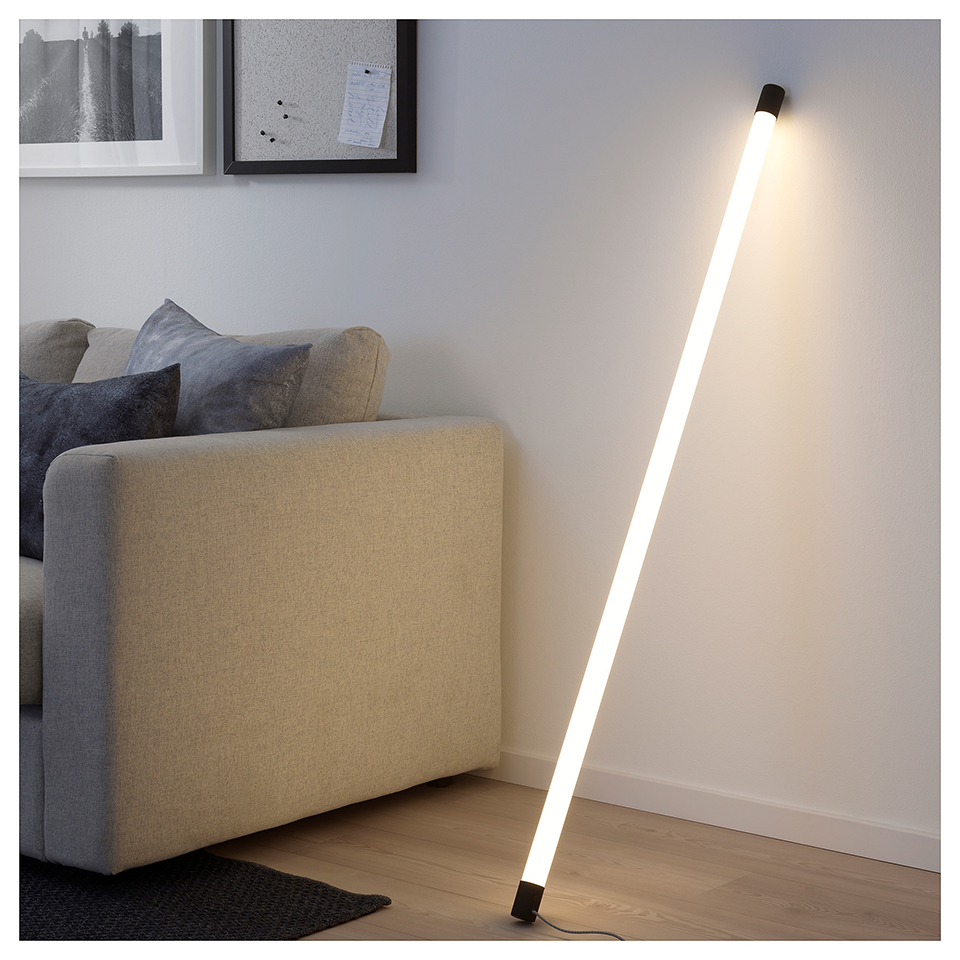
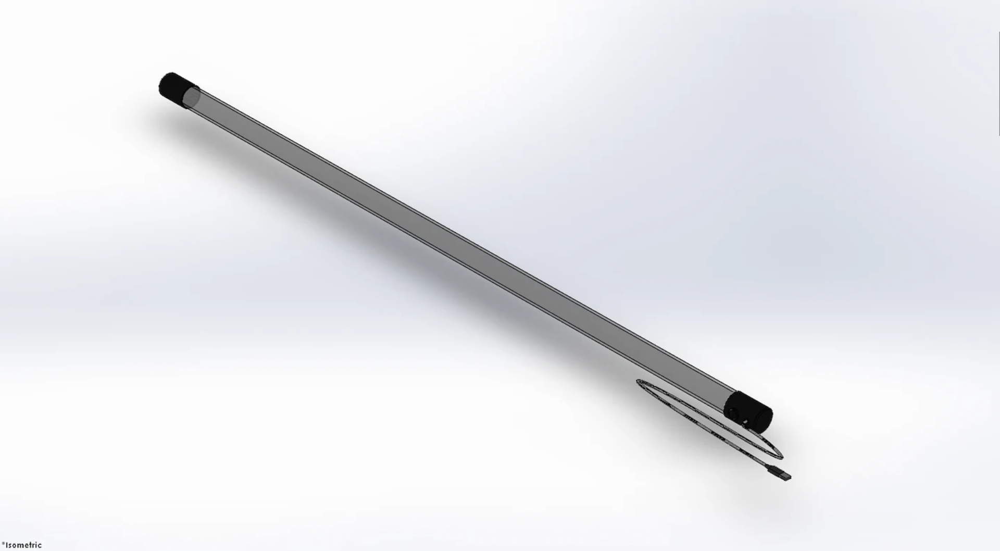

# Light Bar

The light bar is a simple and minimalistic lighting solution. This would mainly be used for decorative purposes and serves as an aesthetic light in any room.

[FULL DESIGN](https://matthewcheng.carbonmade.com/projects/7134197) 

## About Project

* Designed a minimalistic LED light bar for decorative purposes using SolidWorks
* Programmed the light bar’s functions using an Arduino Nano and C/C++
* Parts manufactured using ABS or PLA and 3-D printing

## Tech Stack
* Arduino Nano
* C/C++
* SolidWorks
* 3-D Printing
